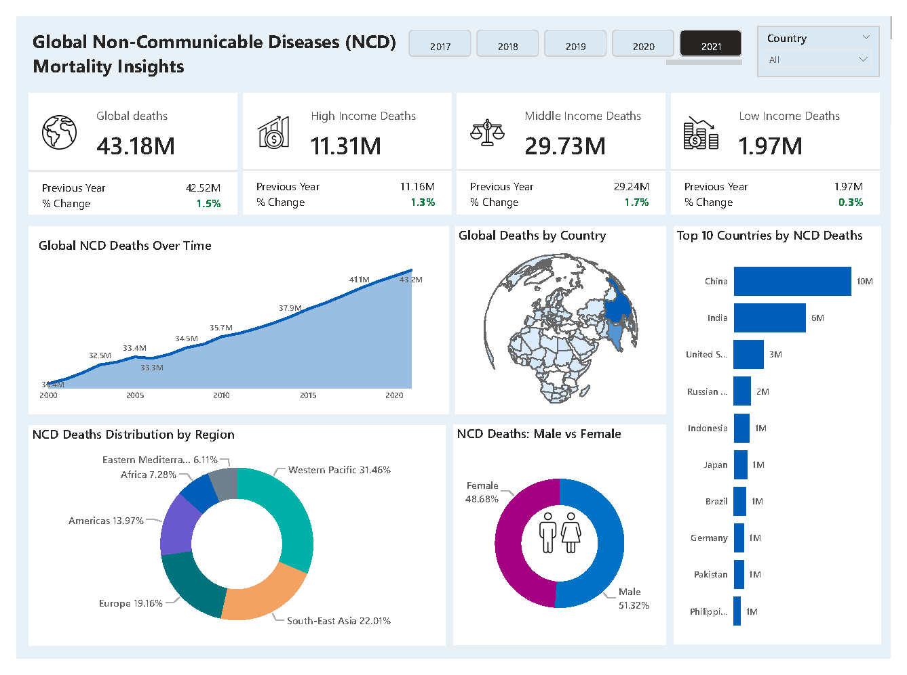

# Global NCD Mortality Insights Dashboard

This Power BI dashboard visualizes global trends in **non-communicable disease (NCD) mortality** using official data from the **World Health Organization (WHO)**. It aims to uncover patterns across regions, income groups, and gender — helping to raise awareness of a silent global epidemic.

---

## 🩺 What Are NCDs?

Non-communicable diseases (NCDs) are chronic illnesses that **cannot be transmitted from person to person**. They include:
- 🫀 Cardiovascular diseases (e.g. heart attack, stroke)
- 🎗️ Cancers
- 🌬️ Chronic respiratory diseases
- 🍬 Diabetes

NCDs are responsible for over **43 million deaths annually** — 75% of all non-pandemic-related deaths — with the majority occurring in **low- and middle-income countries**.

---

## 📈 Dashboard Features

- 📅 **Trend line** showing global NCD deaths over time
- 🗺️ **World map** highlighting country-level mortality
- 📊 **Top 10 countries** by NCD deaths
- 🚻 **Male vs Female** death comparison (donut chart)
- 🌍 **NCD deaths by WHO region** (donut chart)
- 💰 **KPI cards** for global, high-, middle-, and low-income group deaths
- 🎛️ Interactive **filters** for year and country

---

## 🛠️ Tools Used

- [Power BI](https://powerbi.microsoft.com/)
- DAX (Data Analysis Expressions)
- WHO Global Health Observatory (GHO) datasets

---

## 🖼️ Dashboard Preview

---

## 📁 Project Structure

---

## 📂 Data Source

The dataset was sourced from the [World Health Organization (WHO)](https://www.who.int/data/gho/data/themes/topics/noncommunicable-diseases)

This project is for educational and analytical purposes.

---

## 💡 Author Note

This project is part of a data storytelling series on global NCD trends.  
More insights coming soon, including:
- Risk factor analysis
- Premature NCD deaths
- Income-based disparities

Feel free to **fork**, **clone**, or **reach out** with feedback!

---

